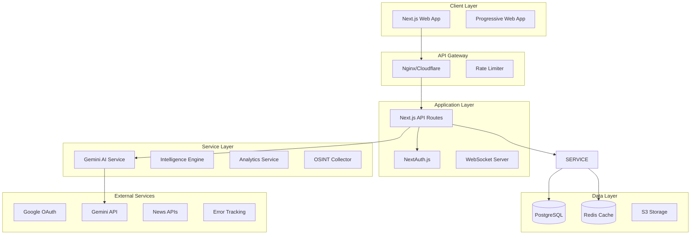

# SYSTEM ARCHITECTURE DESIGN
## Production-Ready Architecture for LIONSPACE

---

## HIGH-LEVEL ARCHITECTURE



---

## DETAILED COMPONENT ARCHITECTURE

### 1. Frontend Architecture

```typescript
// Component Structure
src/
├── app/                      # Next.js App Router
│   ├── (auth)/              # Auth group routes
│   ├── (dashboard)/         # Protected routes
│   ├── api/                 # API routes
│   └── layout.tsx           # Root layout
├── components/
│   ├── ui/                  # Base UI components
│   ├── features/            # Feature components
│   ├── layouts/             # Layout components
│   └── providers/           # Context providers
├── lib/
│   ├── api/                 # API clients
│   ├── hooks/               # Custom hooks
│   ├── utils/               # Utilities
│   └── validations/         # Schemas
├── services/                # Business logic
├── store/                   # State management
└── types/                   # TypeScript types
```

### 2. Backend Architecture

```typescript
// API Structure
api/
├── auth/
│   ├── [...nextauth].ts    # NextAuth config
│   ├── register.ts          # User registration
│   └── profile.ts           # Profile management
├── intelligence/
│   ├── analyze.ts           # AI analysis
│   ├── threats.ts           # Threat detection
│   ├── campaigns.ts         # Campaign generation
│   └── osint.ts            # OSINT operations
├── data/
│   ├── dashboard.ts         # Dashboard data
│   ├── metrics.ts           # Analytics metrics
│   └── export.ts            # Data export
├── admin/
│   ├── users.ts             # User management
│   ├── system.ts            # System config
│   └── logs.ts              # Log access
└── webhooks/
    ├── stripe.ts            # Payment webhooks
    └── github.ts            # CI/CD webhooks
```

### 3. Database Architecture

```sql
-- Core Tables
CREATE TABLE users (
    id UUID PRIMARY KEY,
    email VARCHAR(255) UNIQUE NOT NULL,
    name VARCHAR(255),
    avatar_url TEXT,
    role VARCHAR(50) DEFAULT 'user',
    created_at TIMESTAMP DEFAULT NOW(),
    updated_at TIMESTAMP DEFAULT NOW()
);

CREATE TABLE sessions (
    id UUID PRIMARY KEY,
    user_id UUID REFERENCES users(id),
    token TEXT UNIQUE NOT NULL,
    expires_at TIMESTAMP NOT NULL,
    created_at TIMESTAMP DEFAULT NOW()
);

CREATE TABLE intelligence_reports (
    id UUID PRIMARY KEY,
    user_id UUID REFERENCES users(id),
    title VARCHAR(255) NOT NULL,
    content JSONB NOT NULL,
    threat_level VARCHAR(20),
    status VARCHAR(20) DEFAULT 'draft',
    created_at TIMESTAMP DEFAULT NOW(),
    updated_at TIMESTAMP DEFAULT NOW()
);

CREATE TABLE campaigns (
    id UUID PRIMARY KEY,
    user_id UUID REFERENCES users(id),
    name VARCHAR(255) NOT NULL,
    objectives TEXT[],
    target_audience JSONB,
    channels TEXT[],
    status VARCHAR(20) DEFAULT 'planning',
    metrics JSONB,
    created_at TIMESTAMP DEFAULT NOW()
);

CREATE TABLE osint_data (
    id UUID PRIMARY KEY,
    source VARCHAR(100),
    content TEXT,
    metadata JSONB,
    verified BOOLEAN DEFAULT FALSE,
    threat_indicators JSONB,
    collected_at TIMESTAMP DEFAULT NOW()
);

-- Indexes
CREATE INDEX idx_users_email ON users(email);
CREATE INDEX idx_reports_user ON intelligence_reports(user_id);
CREATE INDEX idx_osint_source ON osint_data(source);
CREATE INDEX idx_osint_collected ON osint_data(collected_at DESC);
```

### 4. Service Layer Architecture

```typescript
// Service Interfaces
interface IntelligenceService {
  analyzeText(text: string): Promise<Analysis>
  detectThreats(data: any): Promise<Threat[]>
  generateReport(params: ReportParams): Promise<Report>
  trackNarratives(keywords: string[]): Promise<Narrative[]>
}

interface OSINTService {
  collectData(sources: Source[]): Promise<OSINTData[]>
  verifyInformation(data: any): Promise<Verification>
  archiveData(data: OSINTData): Promise<void>
  searchArchive(query: string): Promise<SearchResults>
}

interface CampaignService {
  generateCampaign(objectives: string[]): Promise<Campaign>
  optimizeCampaign(id: string): Promise<Optimization>
  trackPerformance(id: string): Promise<Metrics>
  exportCampaign(id: string): Promise<Export>
}

interface AnalyticsService {
  trackEvent(event: AnalyticsEvent): Promise<void>
  getMetrics(period: Period): Promise<Metrics>
  generateDashboard(userId: string): Promise<Dashboard>
  exportAnalytics(params: ExportParams): Promise<Export>
}
```

---

## TECHNOLOGY STACK

### Core Technologies

| Layer | Technology | Purpose |
|-------|------------|---------|
| **Frontend** | Next.js 15 | React framework |
| **Styling** | Tailwind CSS 4 | Utility CSS |
| **Components** | Shadcn/UI | Component library |
| **State** | Zustand | State management |
| **Forms** | React Hook Form + Zod | Form validation |
| **Animation** | Framer Motion | Animations |
| **Charts** | Recharts | Data visualization |
| **3D** | Three.js | 3D graphics |

### Backend Technologies

| Layer | Technology | Purpose |
|-------|------------|---------|
| **Runtime** | Node.js 20 | JavaScript runtime |
| **Framework** | Next.js API | API routes |
| **Auth** | NextAuth.js | Authentication |
| **Database** | PostgreSQL | Primary database |
| **ORM** | Prisma | Database ORM |
| **Cache** | Redis | Caching layer |
| **Queue** | Bull | Job queue |
| **WebSocket** | Socket.io | Real-time |

### Infrastructure

| Service | Provider | Purpose |
|---------|----------|---------|
| **Hosting** | Vercel | Application hosting |
| **Database** | Supabase | Managed PostgreSQL |
| **Cache** | Upstash | Managed Redis |
| **Storage** | AWS S3 | File storage |
| **CDN** | Cloudflare | Content delivery |
| **Email** | SendGrid | Transactional email |
| **Monitoring** | Sentry | Error tracking |
| **Analytics** | Vercel Analytics | Performance |

---

## API DESIGN

### RESTful Endpoints

```typescript
// Authentication
POST   /api/auth/register
POST   /api/auth/login
POST   /api/auth/logout
GET    /api/auth/session
PUT    /api/auth/profile

// Intelligence
POST   /api/intelligence/analyze
GET    /api/intelligence/threats
POST   /api/intelligence/report
GET    /api/intelligence/narratives

// OSINT
GET    /api/osint/search
POST   /api/osint/collect
PUT    /api/osint/verify
GET    /api/osint/archive

// Campaigns
POST   /api/campaigns/generate
GET    /api/campaigns/:id
PUT    /api/campaigns/:id
DELETE /api/campaigns/:id
GET    /api/campaigns/:id/metrics

// Dashboard
GET    /api/dashboard/overview
GET    /api/dashboard/metrics
GET    /api/dashboard/alerts
GET    /api/dashboard/activity
```

### WebSocket Events

```typescript
// Real-time events
socket.on('threat:detected', (threat) => {})
socket.on('analysis:complete', (result) => {})
socket.on('osint:update', (data) => {})
socket.on('metric:update', (metric) => {})
socket.on('alert:new', (alert) => {})
```

---

## SECURITY ARCHITECTURE

### Security Layers

1. **Network Security**
   - Cloudflare DDoS protection
   - Rate limiting per IP/user
   - Web Application Firewall (WAF)

2. **Application Security**
   - Input validation (Zod schemas)
   - SQL injection prevention (Prisma)
   - XSS protection (React default)
   - CSRF tokens
   - Content Security Policy

3. **Authentication & Authorization**
   - OAuth 2.0 (Google)
   - JWT tokens
   - Role-based access control (RBAC)
   - Session management
   - MFA support

4. **Data Security**
   - Encryption at rest (AES-256)
   - Encryption in transit (TLS 1.3)
   - PII data masking
   - Audit logging
   - GDPR compliance

---

## SCALABILITY DESIGN

### Horizontal Scaling

```yaml
# Kubernetes deployment
apiVersion: apps/v1
kind: Deployment
metadata:
  name: lionspace-app
spec:
  replicas: 3
  strategy:
    type: RollingUpdate
  template:
    spec:
      containers:
      - name: app
        image: lionspace:latest
        resources:
          requests:
            memory: "512Mi"
            cpu: "500m"
          limits:
            memory: "1Gi"
            cpu: "1000m"
```

### Caching Strategy

1. **CDN Level** - Static assets (images, CSS, JS)
2. **Redis Cache** - Session data, API responses
3. **Database Cache** - Query results
4. **Application Cache** - Computed values

### Performance Targets

- **Response Time**: < 200ms (p95)
- **Throughput**: 10,000 req/s
- **Availability**: 99.9% uptime
- **Error Rate**: < 0.1%
- **Database Queries**: < 50ms

---

## MONITORING & OBSERVABILITY

### Metrics Collection

```typescript
// Custom metrics
interface Metrics {
  // Performance
  responseTime: Histogram
  throughput: Counter
  errorRate: Gauge
  
  // Business
  activeUsers: Gauge
  analysisCount: Counter
  threatDetections: Counter
  
  // System
  cpuUsage: Gauge
  memoryUsage: Gauge
  dbConnections: Gauge
}
```

### Logging Strategy

```typescript
// Structured logging
logger.info({
  event: 'analysis_completed',
  userId: user.id,
  duration: performance.now() - start,
  resultSize: result.length,
  timestamp: new Date().toISOString()
})
```

---

## DEPLOYMENT ARCHITECTURE

### CI/CD Pipeline

```yaml
# GitHub Actions workflow
name: Deploy Production
on:
  push:
    branches: [main]

jobs:
  test:
    runs-on: ubuntu-latest
    steps:
      - uses: actions/checkout@v3
      - run: npm test
      - run: npm run build

  deploy:
    needs: test
    runs-on: ubuntu-latest
    steps:
      - uses: vercel/action@v2
        with:
          vercel-token: ${{ secrets.VERCEL_TOKEN }}
```

### Environment Strategy

| Environment | Purpose | URL |
|------------|---------|-----|
| Development | Local development | http://localhost:3000 |
| Staging | Pre-production testing | https://staging.lionsofzion.io |
| Production | Live application | https://www.lionsofzion.io |

---

## DISASTER RECOVERY

### Backup Strategy
- **Database**: Daily automated backups (30-day retention)
- **Files**: S3 versioning enabled
- **Code**: Git repository (multiple remotes)
- **Config**: Encrypted secret management

### Recovery Targets
- **RTO** (Recovery Time Objective): 1 hour
- **RPO** (Recovery Point Objective): 1 hour
- **Backup Testing**: Monthly
- **Failover**: Automatic with health checks

---

## COST ESTIMATION

### Monthly Infrastructure Costs

| Service | Provider | Cost |
|---------|----------|------|
| Hosting | Vercel Pro | $20 |
| Database | Supabase | $25 |
| Redis | Upstash | $10 |
| Storage | AWS S3 | $5 |
| CDN | Cloudflare | $20 |
| Monitoring | Sentry | $26 |
| Email | SendGrid | $15 |
| **Total** | | **$121/month** |

### Scaling Costs (10,000 users)
- Hosting: $150/month
- Database: $100/month
- Total: ~$400/month

---

## IMPLEMENTATION PRIORITY

1. **Week 1**: Database + Auth
2. **Week 2**: Core API endpoints
3. **Week 3**: Service layer
4. **Week 4**: Caching + optimization
5. **Week 5**: Monitoring + logging
6. **Week 6**: Security hardening
7. **Week 7**: Testing + documentation
8. **Week 8**: Deployment + launch

This architecture provides a solid foundation for a production-ready application that can scale to thousands of users while maintaining performance and security.