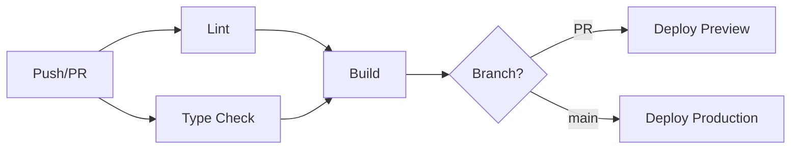

# Deployment Guide - CI/CD Pipeline

## 🚀 Overview

This project uses GitHub Actions for automated CI/CD pipeline with Vercel for deployment. The pipeline ensures code quality, builds successfully, and deploys preview/production versions automatically.

## 🔄 CI/CD Workflow

### Pipeline Stages



### Workflow Jobs

#### 1. **Lint** (`lint`)
- Runs ESLint on all TypeScript/JavaScript files
- Ensures code style consistency
- Fails pipeline if linting errors found

#### 2. **Type Check** (`type-check`)
- Runs TypeScript compiler with `--noEmit`
- Validates all types and interfaces
- Ensures type safety across the codebase

#### 3. **Build** (`build`)
- Installs dependencies with `npm ci`
- Runs `npm run build` to create production bundle
- Validates that application builds successfully
- Depends on successful lint and type-check

#### 4. **Deploy Preview** (`deploy-preview`)
- Triggers on Pull Requests only
- Creates Vercel preview deployment
- Provides unique URL for testing changes
- Dependencies: successful build

#### 5. **Deploy Production** (`deploy-production`)
- Triggers on main branch pushes only
- Deploys to production Vercel environment
- Updates live application
- Dependencies: successful build

## ⚙️ Configuration

### GitHub Secrets Required

Add these secrets in GitHub repository settings (`Settings > Secrets and variables > Actions`):

```bash
VERCEL_TOKEN          # Vercel CLI authentication token
VERCEL_ORG_ID         # Vercel organization ID
VERCEL_PROJECT_ID     # Vercel project ID
```

### Getting Vercel Credentials

1. **Install Vercel CLI**
   ```bash
   npm install -g vercel@latest
   ```

2. **Login and Link Project**
   ```bash
   vercel login
   vercel link
   ```

3. **Get Organization and Project IDs**
   ```bash
   # View project info
   cat .vercel/project.json
   ```

4. **Get Auth Token**
   ```bash
   vercel tokens create
   ```

### Workflow Configuration

The workflow is defined in `.github/workflows/deploy.yml`:

```yaml
name: Deploy to Vercel

on:
  push:
    branches: [main]
  pull_request:
    branches: [main]

env:
  VERCEL_ORG_ID: ${{ secrets.VERCEL_ORG_ID }}
  VERCEL_PROJECT_ID: ${{ secrets.VERCEL_PROJECT_ID }}
```

## 🌐 Deployment Environments

### Preview Deployments
- **Trigger**: Pull Requests to main branch
- **URL**: `https://<pr-id>-lionspace-nextjs-modern.vercel.app`
- **Purpose**: Test changes before merging
- **Lifetime**: Until PR is closed/merged

### Production Deployment
- **Trigger**: Push to main branch
- **URL**: `https://lionspace-nextjs-modern.vercel.app` (or custom domain)
- **Purpose**: Live application
- **Environment**: Production configuration

## 🔧 Local Deployment Testing

### Test Build Locally
```bash
# Install dependencies
npm ci

# Run all checks pipeline runs
npm run lint
npm run typecheck
npm run build

# Test production build locally
npm run start
```

### Test with Vercel CLI
```bash
# Install Vercel CLI
npm install -g vercel@latest

# Login to Vercel
vercel login

# Link project
vercel link

# Deploy to preview
vercel

# Deploy to production
vercel --prod
```

## 🐛 Troubleshooting

### Common Pipeline Failures

#### Lint Failures
```bash
# Run locally to see errors
npm run lint

# Auto-fix where possible
npm run lint -- --fix
```

#### Type Check Failures
```bash
# Run locally to see type errors
npm run typecheck

# Check specific file
npx tsc --noEmit src/path/to/file.ts
```

#### Build Failures
```bash
# Run build locally
npm run build

# Check for missing dependencies
npm install

# Clear cache and retry
rm -rf .next node_modules
npm install
npm run build
```

#### Deployment Failures

**Vercel Token Issues**
- Verify token is valid: `vercel whoami`
- Check token permissions in Vercel dashboard
- Regenerate token if expired

**Project Configuration Issues**
- Verify `VERCEL_ORG_ID` and `VERCEL_PROJECT_ID`
- Check project exists in Vercel dashboard
- Ensure GitHub integration is connected

**Environment Variables**
- Check required environment variables in Vercel dashboard
- Verify secrets are correctly set in GitHub

### Debug Workflow Issues

1. **Check GitHub Actions Logs**
   - Go to repository > Actions tab
   - Click on failed workflow run
   - Examine logs for each job

2. **Test Locally**
   - Run exact commands from workflow
   - Match Node.js version (20.x)
   - Use same environment variables

3. **Vercel Dashboard**
   - Check deployment logs in Vercel
   - Verify project settings
   - Review build settings

## 📊 Monitoring & Metrics

### Build Metrics
- **Build Time**: Target < 3 minutes
- **Bundle Size**: Monitor via Next.js build output
- **Type Check Time**: Target < 30 seconds
- **Lint Time**: Target < 15 seconds

### Deployment Metrics
- **Deployment Success Rate**: Target 99%+
- **Preview Generation Time**: Target < 2 minutes
- **Production Deployment Time**: Target < 5 minutes

### Performance Monitoring
- Core Web Vitals tracking via Vercel Analytics
- Error tracking via Vercel Error Monitoring
- Performance insights via Vercel Speed Insights

## 🔐 Security

### Pipeline Security
- ✅ No secrets in code repository
- ✅ Read-only permissions where possible
- ✅ Environment isolation
- ✅ Audit logs for all deployments

### Deployment Security
- ✅ HTTPS enforcement
- ✅ Security headers (CSP, HSTS, etc.)
- ✅ Environment variable encryption
- ✅ Build output scanning

## 📋 Best Practices

### Development Workflow
1. **Create Feature Branch**
   ```bash
   git checkout -b feature/your-feature
   ```

2. **Test Locally**
   ```bash
   npm run lint
   npm run typecheck
   npm run build
   ```

3. **Create Pull Request**
   - Pipeline automatically runs
   - Preview deployment created
   - Review preview before merge

4. **Merge to Main**
   - Production deployment triggered
   - Monitor deployment in Vercel dashboard

### Code Quality Gates
- ✅ ESLint must pass (no errors allowed)
- ✅ TypeScript must compile successfully
- ✅ Build must complete without errors
- ✅ All tests must pass (when implemented)

### Deployment Strategy
- **Preview First**: Always test in preview environment
- **Gradual Rollout**: Monitor after production deployment
- **Quick Rollback**: Use Vercel's instant rollback if issues arise

## 🔄 Maintenance

### Regular Tasks
- **Weekly**: Review failed deployments and fix issues
- **Monthly**: Update dependencies and security patches
- **Quarterly**: Review and optimize build performance

### Updates
- **Workflow Updates**: Test in feature branch first
- **Dependency Updates**: Use automated tools like Dependabot
- **Security Updates**: Apply immediately for critical issues

## 📞 Support

### Deployment Issues
1. Check GitHub Actions logs
2. Review Vercel deployment logs
3. Test locally with same configuration
4. Contact team leads for access issues

### Resources
- [GitHub Actions Documentation](https://docs.github.com/en/actions)
- [Vercel Documentation](https://vercel.com/docs)
- [Next.js Deployment Guide](https://nextjs.org/docs/deployment)