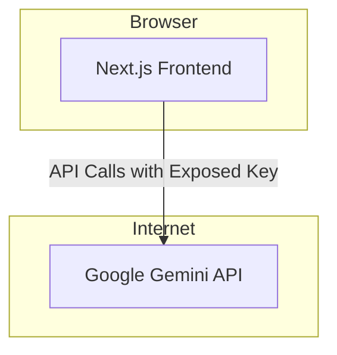

# Inventory

## 1. Repository Tracks

This repository contains a single track:

-   **Lions of Zion Website**: A Next.js application.

## 2. Top-Level Folder Tree

```
.github/
.storybook/
DESIGN_SYSTEM_TASKS.md
DESIGN_TOKENS.md
GEMINI.md
README.md
agents.md
apphosting.yaml
components.json
docs/
eslint.config.mjs
lions_of_zion_agent_prompts_claude_spark_full_pack.md
middleware.ts
next.config.ts
package.json
playwright.config.ts
pnpm-lock.yaml
pnpm-workspace.yaml
postcss.config.mjs
scripts/
src/
tailwind.config.ts
test/
tsconfig.json
vitest.config.ts
```

## 3. Dependencies & Runtimes

### 3.1. Runtimes

| Runtime     | Version | Specified In          |
| :---------- | :------ | :-------------------- |
| Node.js     | 22.x    | `.github/workflows/ci.yml` |
| pnpm        | 10.17.0 | `package.json` (packageManager) |
| Next.js     | 15.5.3  | `package.json`        |
| React       | 19.1.1  | `package.json`        |
| TypeScript  | 5.9.2   | `package.json`        |

### 3.2. Production Dependencies

| Name                      | Version |
| :------------------------ | :------ |
| @genkit-ai/googleai       | ^1.19.3 |
| @genkit-ai/next           | ^1.19.3 |
| @hookform/resolvers       | ^5.2.2  |
| @radix-ui/react-accordion | ^1.2.12 |
| @radix-ui/react-alert-dialog | ^1.1.15 |
| @radix-ui/react-avatar    | ^1.1.10 |
| @radix-ui/react-checkbox  | ^1.3.3  |
| @radix-ui/react-collapsible | ^1.1.12 |
| @radix-ui/react-dialog    | ^1.1.15 |
| @radix-ui/react-dropdown-menu | ^2.1.16 |
| @radix-ui/react-label     | ^2.1.7  |
| @radix-ui/react-menubar   | ^1.1.16 |
| @radix-ui/react-popover   | ^1.1.15 |
| @radix-ui/react-progress  | ^1.1.7  |
| @radix-ui/react-radio-group | ^1.3.8  |
| @radix-ui/react-scroll-area | ^1.2.10 |
| @radix-ui/react-select    | ^2.2.6  |
| @radix-ui/react-separator | ^1.1.7  |
| @radix-ui/react-slider    | ^1.3.6  |
| @radix-ui/react-slot      | ^1.2.3  |
| @radix-ui/react-switch    | ^1.2.6  |
| @radix-ui/react-tabs      | ^1.1.13 |
| @radix-ui/react-toast     | ^1.2.15 |
| @radix-ui/react-tooltip   | ^1.2.8  |
| @tanstack/react-query     | ^5.89.0 |
| chart.js                  | ^4.5.0  |
| class-variance-authority  | ^0.7.1  |
| clsx                      | ^2.1.1  |
| date-fns                  | ^4.1.0  |
| dotenv                    | ^17.2.2 |
| embla-carousel-react      | ^8.6.0  |
| firebase                  | ^12.3.0 |
| genkit                    | ^1.19.3 |
| lucide-react              | ^0.544.0|
| next                      | 15.5.3  |
| next-seo                  | ^6.8.0  |
| next-themes               | ^0.4.6  |
| patch-package             | ^8.0.0  |
| react                     | ^19.1.1 |
| react-chartjs-2           | ^5.3.0  |
| react-day-picker          | ^9.11.0 |
| react-dom                 | ^19.1.1 |
| react-hook-form           | ^7.63.0 |
| recharts                  | ^3.2.1  |
| tailwind-merge            | ^3.3.1  |
| tailwindcss-animate       | ^1.0.7  |
| zod                       | ^3.25.76|

### 3.3. Development Dependencies

| Name                        | Version |
| :-------------------------- | :------ |
| @axe-core/playwright        | ^4.10.2 |
| @eslint/compat              | ^1.3.2  |
| @eslint/eslintrc            | ^3      |
| @eslint/js                  | ^9.36.0 |
| @next/eslint-plugin-next    | ^15.5.3 |
| @playwright/test            | ^1.55.0 |
| @storybook/addon-essentials | ^8.6.14 |
| @storybook/addon-interactions | ^8.6.14 |
| @storybook/addon-links      | ^8.6.14 |
| @storybook/addon-onboarding | ^8.6.14 |
| @storybook/blocks           | ^8.6.14 |
| @storybook/nextjs           | ^8.6.14 |
| @storybook/react            | ^8.6.14 |
| @storybook/testing-library  | ^0.2.2  |
| @tailwindcss/forms          | ^0.5.10 |
| @tailwindcss/postcss        | ^4.1.13 |
| @tailwindcss/typography     | ^0.5.18 |
| @testing-library/jest-dom   | ^6.8.0  |
| @testing-library/react      | ^16.3.0 |
| @types/node                 | ^24.5.2 |
| @types/react                | ^19.1.13|
| @types/react-dom            | ^19.1.9 |
| @typescript-eslint/eslint-plugin | ^8.44.0 |
| @typescript-eslint/parser   | ^8.44.0 |
| @vitejs/plugin-react        | ^5.0.3  |
| axe-core                    | ^4.10.3 |
| concurrently                | ^9.2.1  |
| eslint                      | ^9.36.0 |
| eslint-config-next          | 15.5.3  |
| genkit-cli                  | ^1.19.3 |
| globals                     | ^16.4.0 |
| jsdom                       | ^27.0.0 |
| open-cli                    | ^8.0.0  |
| postcss                     | ^8.5.6  |
| storybook                   | ^8.6.14 |
| tailwindcss                 | ^4.1.13 |
| typescript                  | ^5.9.2  |
| vitest                      | ^3.2.4  |
| wait-port                   | ^1.1.0  |

## 4. CI/CD Overview

The project uses GitHub Actions for Continuous Integration. The workflow is defined in `.github/workflows/ci.yml`.

-   **Triggers**: The CI pipeline runs on `push` and `pull_request` events to the `main` branch.
-   **Jobs**: A single `build` job runs on an `ubuntu-latest` runner.
-   **Steps**:
    1.  Checks out the code.
    2.  Sets up pnpm version 10.
    3.  Sets up Node.js version 22.
    4.  Installs dependencies using `pnpm install`.
    5.  Runs `pnpm lint`.
    6.  Runs `pnpm typecheck`.
    7.  Runs `pnpm test`.

## 5. Configuration & Environment

-   There is no `.env.example` or similar file checked into the repository.
-   The application may require environment variables to run, but they are not documented in a template file. This is a documentation gap.

## 6. Documentation

The repository contains the following documentation:

-   `README.md`: Standard project README.
-   `agents.md`: Instructions for AI agents working on the codebase.
-   `docs/blueprint.md`: (Content unknown)
-   `docs/development-setup.md`: (Content unknown)

### 6.1. Documentation Gaps

-   **Missing Environment Variable Documentation**: Crucial for setting up a local development environment.
-   **Component Documentation**: No Storybook stories for many components, and no detailed documentation on component props and usage.
-   **Architectural Overview**: Lack of a high-level document explaining the project's architecture, data flow, and major components.
-   **API Documentation**: If the application exposes or consumes APIs, there is no documentation for them.

## 7. Architecture Map

As diagram generation is not possible, here is a Mermaid snippet representing the current-state high-level topology.


